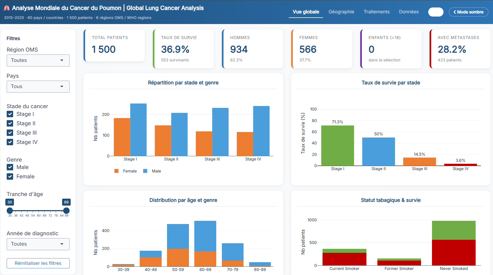

# Lung Cancer Dashboard

## Aperçu / Preview



## Application en ligne / Live App

**[Accéder au dashboard / Open dashboard](https://hippy26.shinyapps.io/lungcancer)**

## Prérequis

Installez R (>= 4.1) depuis https://cran.r-project.org/
puis ouvrez RStudio ou un terminal R et exécutez :

```r
install.packages(c("shiny","bslib","dplyr","plotly","DT"))
```

## Lancement

1. Placez le fichier `lung_cancer_dataset.csv` dans le même dossier que `ui.R` et `server.R`
2. Dans R / RStudio :

```r
setwd("/chemin/vers/shiny_app")
shiny::runApp()
```

Le navigateur s'ouvre automatiquement sur `http://127.0.0.1:PORT`

## Contenu du tableau de bord

### Onglet 1 – Vue globale
- Filtres : région OMS, pays, stade, genre, âge, année
- KPIs : total patients, taux de survie, hommes, femmes, enfants, métastases
- Graphiques : stade × genre, survie par stade, pyramide des âges, tabagisme × survie

### Onglet 2 – Géographie
- Carte mondiale choroplèthe (indicateur au choix par pays)
  - Total patients, taux de survie, nb femmes/hommes/enfants, taille tumorale, survie moy.
- Tableau classement par pays avec barre de survie colorée
- Filtre par région OMS et stade

### Onglet 3 – Traitements & Mutations
- Taux de survie par traitement (barres horizontales)
- Répartition des mutations génétiques (donut)
- Types de cancer NSCLC/SCLC (donut)
- Heatmap survie moyenne par traitement × stade
- Méthodes de diagnostic

### Onglet 4 – Données
- Table interactive filtrée (tous les filtres de l'onglet 1)
- Bouton export CSV

